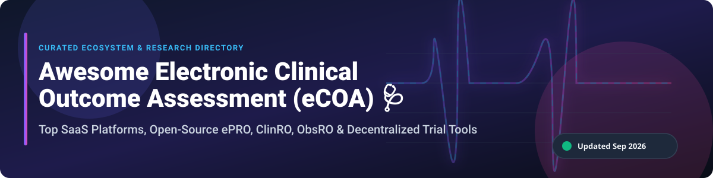

# 🩺 Awesome Electronic Clinical Outcome Assessment (eCOA) 📊

  

  
  
  
  

---

## 💡 Overview & Ecosystem

Welcome to the **Awesome Electronic Clinical Outcome Assessment (eCOA)** curated directory! 🌟 This repository tracks notable **SaaS platforms**, **open-source software**, and **clinical research tools** for **Electronic Clinical Outcome Assessment (eCOA)**, **Patient-Reported Outcomes (ePRO)**, Clinician-Reported Outcomes (ClinRO), Observer-Reported Outcomes (ObsRO), and Performance Outcomes (PerfO) used in global clinical trials, decentralized clinical trials (DCT), registries, and real-world evidence (RWE) studies. 🏥📱

---

## 📑 Table of Contents

- [🏢 SaaS/Hosted Platforms](#-saashosted-platforms)
- [💻 Open-Source GitHub Projects](#-open-source-github-projects)
- [🤝 How to Contribute](#-how-to-contribute)
- [☕ Support](#-support)
- [📈 Star History](#-star-history)
- [⚠️ Disclaimer](#%EF%B8%8F-disclaimer)

---

## 🏢 SaaS/Hosted Platforms

> 📈 **Sector Market Size & Dynamics:**  
> The global **Electronic Clinical Outcome Assessment (eCOA)** market is valued at approximately **\$2.2B – \$2.5B (2026)** and is projected to reach **\$5.0B+ by 2032** growing at a CAGR of ~14.5%. The market is **moderately concentrated** among top enterprise eClinical tech providers and CRO conglomerates, with key consolidation driven by mega-acquisitions (such as Thermo Fisher acquiring Clario for ~\$8.9B).

| Platform 🌐 | Annual Revenue / Valuation 💰 | Starting Price 💵 | Free Tier / Free Trial Limits 🎁 | Key Features & Focus ⚡ |
| :--- | :--- | :--- | :--- | :--- |
| **[IQVIA eCOA](https://www.iqvia.com/)** | **\$15.4B** (2025 Annual Revenue) | \$50,000 / study starting license | 30-day sandbox trial for enterprise sponsors | Enterprise eCOA, ePRO, and eConsent deeply integrated with IQVIA global R&D clinical ecosystem. |
| **[Clario eCOA](https://clario.com/)** | **\$8.9B** (Valuation via Thermo Fisher acquisition) | \$35,000 / study base tier | 14-day staging environment trial upon request | Formed from ERT & Bioclinica merger. Leader in endpoint validation, BYOD/provisioned devices. |
| **[Signant Health](https://www.signanthealth.com/)** | **\$450M** (Estimated Annual Revenue) | \$25,000 / study starting tier | 30-day demo portal access for qualified trial sponsors | Specialized in eCOA, eConsent, IRT, rater training, and CNS/psychiatry trial endpoint rigor. |
| **[Medable](https://www.medable.com/)** | **\$2.1B** (Valuation / \$120M+ Revenue) | \$20,000 / trial protocol | 30-day free trial on Medable Studio dev environment | Decentralized trial platform with BYOD ePRO, remote data collection, and patient engagement. |
| **[YPrime](https://www.yprime.com/)** | **\$150M** (Estimated Annual Revenue) | \$20,000 / study starting tier | 14-day sandbox access for trial configurator | Rapid-deployment eCOA, ePRO, and IRT platform with automated localization engines. |
| **[THREAD Research](https://www.threadresearch.com/)** | **\$100M** (Estimated Annual Revenue) | \$18,000 / trial protocol | 30-day trial access for study design sandbox | Decentralized trial & DCT technology with ePRO, telehealth virtual visits, and sensor integration. |
| **[eClinical Solutions](https://www.eclinicalsol.com/)** | **\$80M** (Estimated Annual Revenue) | \$15,000 / study base package | 14-day free trial for elluminate data platform | elluminate clinical data platform supporting eCOA/ePRO data ingestion and analytics. |
| **[Kayentis](https://www.kayentis.com/)** | **\$35M** (Estimated Annual Revenue) | \$12,000 / study starting tier | 14-day trial demo environment for clinical ops teams | Dedicated eCOA specialist for pharma/biotech in respiratory, oncology, and ophthalmology trials. |

---

## 💻 Open-Source GitHub Projects

Open-source options provide transparent, customizable eCOA/ePRO infrastructures without vendor lock-in or per-patient SaaS fees — ideal for academic medical centers, non-profits, and sovereign clinical research institutions. 🔓

| Project 📦 | GitHub Stars ⭐ | License 📜 | Tech Stack 🛠️ | Description & eCOA Capabilities 🚀 |
| :--- | :--- | :--- | :--- | :--- |
| **[OpenClinica](https://github.com/OpenClinica/OpenClinica)** |  | LGPL-2.1 | Java, PostgreSQL | Leading open-source EDC platform with Participate module for browser-based ePRO/eCOA questionnaires and SMS/email reminders. |
| **[PyCap (REDCap API)](https://github.com/redcap-tools/PyCap)** |  | MIT | Python | Python interface for REDCap API, facilitating automated ePRO survey deployment, data extraction, and clinical trial pipelines. |
| **[ODK Collect](https://github.com/getodk/collect)** |  | Apache-2.0 | Java, Android | Powerful mobile data collection app widely used for offline ePRO/eCOA data capture in global health & clinical field trials. |
| **[LibreClinica](https://github.com/LibreClinica/LibreClinica)** |  | LGPL-3.0 | Java, PostgreSQL | GCP-compliant community fork of OpenClinica with OpenRosa API backend for mobile ePRO offline collection via ODK devices. |
| **[redcapAPI](https://github.com/vanderbilt-redcap/redcapAPI)** |  | GPL-2.0 | R | R package for seamless interaction with REDCap ePRO/eCOA survey databases and clinical outcome export pipelines. |
| **[clinicedc edc](https://github.com/clinicedc/edc)** |  | GPL-3.0 | Python, Django | Modular Django clinical trial framework including `edc-qol` with standardized EQ-5D-3L and SF-12 Quality of Life ePRO instruments. |
| **[MII PRO Module](https://github.com/medizininformatik-initiative/kerndatensatzmodul-proms)** |  | CC0-1.0 | FHIR, JSON | Standardized FHIR Implementation Guide & profiles for PROMIS-29, PHQ-9, and EQ-5D-5L clinical outcome data exchange. |

---

## 🤝 How to Contribute

Contributions are highly appreciated! 💖 If you know of an eCOA platform or open-source tool that should be listed:

1. 🍴 **Fork** the repository.
2. 📝 **Add/edit** entries in `README.md` following the table formats above.
3. 🚀 **Submit** a Pull Request with a clear description of the project.

---

## ☕ Support

If you find this repository helpful for your clinical research or tech stack evaluation, please consider supporting the project! 🌟

- ⭐ **Star** this repository to help others discover it.
- 🔀 **Fork** it to keep your own curated reference.
- 📢 **Share** it with colleagues in healthtech and clinical operations.
- 💖 **Buy Me a Coffee**: Support ongoing open-source curation via the [Sponsor Dashboard](https://github.com/sponsors/ishandutta2007).

---

## 📈 Star History

---

## ⚠️ Disclaimer

- This directory is **community-curated** for informational purposes and does not constitute formal procurement endorsement.
- eCOA systems processing patient data must comply with global regulatory standards including **FDA 21 CFR Part 11**, **GCP**, **HIPAA**, and **GDPR**.
